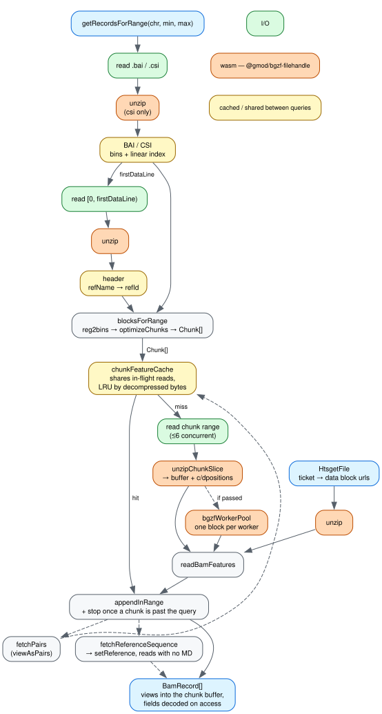

[](https://npmjs.org/package/@gmod/bam)


Parser for BAM files and their BAI/CSI indexes.

## Install

```bash
npm install @gmod/bam
```

## Usage

```typescript
import { BamFile } from '@gmod/bam'

const bam = new BamFile({ bamPath: 'test.bam' })

// same records as `samtools view test.bam ctgA:1-50000`
const records = await bam.getRecordsForRange('ctgA', 0, 50000)
```

Coordinates are 0-based half-open (not the same as `samtools view` inputs).
`bamPath` reads a local file, so it is node-only; in the browser pass a URL or a
generic-filehandle2 filehandle instead:

```typescript
const bam = new BamFile({
  bamUrl: 'https://example.com/yourfile.bam',
  baiUrl: 'https://example.com/yourfile.bam.bai',
})
```

Records come back unfiltered, and are shared between overlapping queries — treat
them as read-only. Filter them yourself with the flag helpers and `getTag`,
which decodes one tag instead of all of them:

```typescript
const records = (await bam.getRecordsForRange('chr1', 0, 100000)).filter(
  r => r.isProperlyPaired() && !r.isSecondary() && r.getTag('RG') === 'rg1',
)
```

## Mismatches

`record.getMismatches()` gives every difference between a read and the reference
— substitutions, insertions, deletions, reference skips and clips — without you
having to interpret `CIGAR` and `MD` yourself. There is a callback form,
`record.forEachMismatch(cb, opts?)`, which allocates nothing per difference and
takes a reference window to report within.

Substitutions need either an `MD` tag on the read or the reference bases, and
most aligners leave `MD` off. `fetchReferenceSequence` is how you supply them:

```typescript
const bam = new BamFile({
  bamPath: 'test.bam',
  fetchReferenceSequence: async (refName, start, end) =>
    myGenome.getSequence(refName, start, end),
})

// one sequence fetch for the whole query, and only if some read needs it
const records = await bam.getRecordsForRange('ctgA', 0, 50000)
records[0].getMismatches()
// [{ code: 88 /* 'X' */, refPos: 188, length: 1, bases: 'A', qual: 17,
//    refBaseCode: 84 /* 'T' */, clipLength: 0 }, ...]
```

Without it, a read lacking `MD` still reports its indels and clips, but no
substitutions — nothing in the record says where they are. See
[docs/api.md](docs/api.md#mismatches) for the field meanings and for reads
longer than the region you are looking at.

## How a query flows



A query resolves its reference name through the index and header, turns the
range into a list of BGZF chunks, and reads each chunk through
`chunkFeatureCache` — which shares a read already in flight and keeps parsed
chunks around, so a pan back over the same region does no I/O at all. Records
are views into their chunk's decompressed buffer; `seq`, `CIGAR`, `tags` and
friends decode on access, so a query costs what you read off it.
([docs/dataflow.dot](docs/dataflow.dot) is the source; regenerate with
`dot -Tsvg docs/dataflow.dot -o docs/dataflow.svg`.)

Everything orange is wasm, in
[`@gmod/bgzf-filehandle`](https://github.com/GMOD/bgzf-filehandle), and it is
only ever inflate. That is where the time is — decompression is 70-90% of a cold
query, against 0.1-15ms for record construction — and libdeflate-in-wasm is
2.6-3.5x a per-block `pako` inflate while sitting at parity with native `zlib`,
so there is no faster codec left to reach for. The boundary is crossed once per
chunk, never per record: a record would have to be serialized back out, and the
wasm heap only grows. What headroom remains is parallelism, which is the worker
pool below. Measurements in
[agent-docs/adr/0022](agent-docs/adr/0022-the-wasm-boundary-sits-at-the-bgzf-block.md).

## Decompressing on a worker pool

BGZF blocks are independently inflatable, so that 70-90% can be spread across
threads. Hand `BamFile` a
[`@gmod/bgzf-filehandle`](https://github.com/GMOD/bgzf-filehandle) worker pool
and it inflates chunks there instead of on the calling thread — measured
2.7-4.1x on the pool's own fixtures.

```typescript
import { getSharedWorkerPool } from '@gmod/bgzf-filehandle'

const bam = new BamFile({
  bamUrl: 'https://example.com/yourfile.bam',
  // the pending promise is fine — it is awaited at the point of use
  bgzfWorkerPool: getSharedWorkerPool(),
})
```

No cross-origin isolation is needed. `getSharedWorkerPool()` gives back
`undefined` under node, or anywhere Workers cannot be created, which keeps the
in-process path — so this is safe to pass unconditionally. bam-js never creates
a pool on its own: the thread budget belongs to the consumer. For worker counts,
lifecycle and the pool's own benchmarks, see
[bgzf-filehandle's worker pool docs](https://github.com/GMOD/bgzf-filehandle/blob/main/docs/worker-pool.md).

## Usage with htsget

```typescript
import { HtsgetFile } from '@gmod/bam'

const bam = new HtsgetFile({
  baseUrl: 'http://htsnexus.rnd.dnanex.us/v1/reads',
  trackId: 'BroadHiSeqX_b37/NA12878',
})
const records = await bam.getRecordsForRange('1', 2000000, 2000001)
```

htsget fetches the server's range as-is, so `viewAsPairs`, `pairAcrossChr` and
`maxInsertSize` are ignored. For a server that requires authentication, pass a
`fetch` that adds the bearer token:

```typescript
const bam = new HtsgetFile({
  baseUrl: 'https://htsget.example.com/reads',
  trackId: 'NA12878',
  fetch: (url, init) => {
    const headers = new Headers(init?.headers)
    headers.set('authorization', `Bearer ${token}`)
    return fetch(url, { ...init, headers })
  },
})
```

Your `fetch` is called for the ticket request _and_ for the data-block urls the
ticket points at, which may live on a third-party host — so only attach
credentials to hosts you trust.

## Docs

- [docs/api.md](docs/api.md) — every constructor option, method and `BamRecord`
  field, plus custom record classes
- [docs/caching.md](docs/caching.md) — sizing the parsed-chunk cache
- [agent-docs/adr/](agent-docs/adr/) — the measurements behind the performance
  and caching decisions
- [CONTRIBUTING.md](CONTRIBUTING.md) — development and release steps

## License

MIT © [Colin Diesh](https://github.com/cmdcolin)
