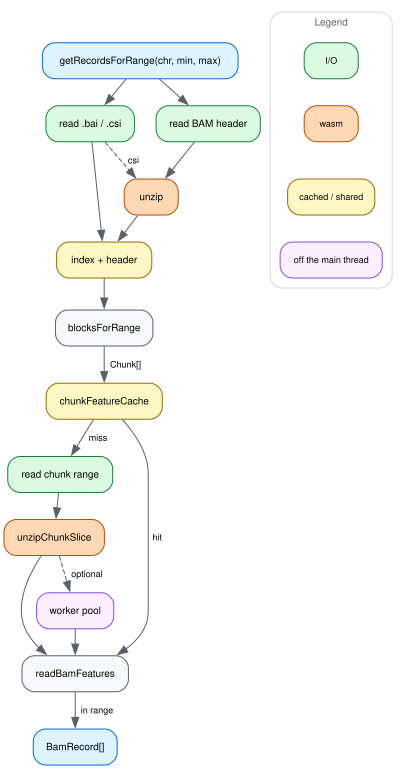

# How a query flows

[dataflow.dot](img/dataflow.dot) is the source; see
[CONTRIBUTING.md](../CONTRIBUTING.md) for how to re-render it.

A query resolves its reference name through the index and header, turns the
range into a list of BGZF chunks, and reads each chunk through
`chunkFeatureCache` — which shares a read already in flight and keeps parsed
chunks around, so a pan back over the same region does no I/O at all. Records
are views into their chunk's decompressed buffer; `seq`, `CIGAR`, `tags` and
friends decode on access, so a query costs what you read off it.

Why each of those steps looks the way it does, and what measured it, is
[optimizations.md](optimizations.md).

Apart from the reference fetch below, the diagram is the main path only. It
leaves out htsget (which has no index and joins at `readBamFeatures`), the
`viewAsPairs` pass, which runs after the records are assembled and goes back
through the same chunk cache, and the early stop once a chunk starts past the
query.

## Where the reference fetch sits

The green node at the bottom is the one place a second data source enters: a
caller-supplied `fetchReferenceSequence`, called at most once per query for the
union span of the reads that arrived without an `MD` tag, so their substitutions
resolve. It runs after `viewAsPairs`, so a mate pulled from another chunk is
covered on the same terms, and the bases bind only to reads the returned region
covers whole — a partial binding would be per-query state on a record shared
between queries
([ADR 0020](../agent-docs/adr/0020-a-bound-reference-must-cover-the-whole-read.md)).
Without the option, or with every read carrying `MD`, nothing is fetched.

## Where the worker pool sits

The purple node is opt-in: pass a `bgzfWorkerPool` and chunk decompression moves
off the main thread, and without one the same code runs in-process. The unit is
a chunk's blocks, not the record building after them — decompression is where a
query's time is (see below), so there is little else worth moving.

"Off the main thread" is relative to wherever the caller runs. Nothing here
needs the main thread, so the whole diagram can sit in a worker of its own, and
the purple node is then a further pool underneath it.

## Where wasm sits

Everything orange is wasm, in
[`@gmod/bgzf-filehandle`](https://github.com/GMOD/bgzf-filehandle), and all of
it is decompressing BGZF blocks — reading the index and decoding records both
stay in JS.

That is where the time is: with nothing cached, decompression takes 70-90% of a
query's wall clock, against 0.1-15ms building records. A call crosses the
boundary once per chunk, never per record. Why, and why there is no faster codec
to reach for: [optimizations.md](optimizations.md#decompression).
